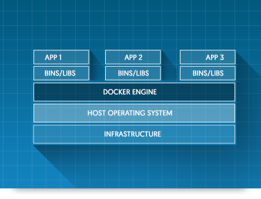

# Resumen

* Qué es Docker
* Qué diferencia existe con una máquina virtual.
* Cómo crear contenedores
* Cómo comunicar contenedores con el **sistema de archivos** y con la **red** del SO anfitrión.
* Cómo crear imágenes de nuestro propio software.
* Cómo utilizar más de un contenedor de manera organizada
* Como hacer un deployment *básico*

# Docker

 * Docker es una plataforma para desarrollar, probar y distribuir aplicaciones.
 * Basada en features de linux: LXC [^netcontainer]
    - Una híbrido entre \sout{fork()}, chroot y gestion de bridges.
 * Compuesta de herramientas de líneas de comandos y un servicio.
 * Con una plataforma online para distribución de **imágenes** que se puede ejecutar en entornos privados.
 * Base para otras herramientas como **Mesos** o **Kubernets**.


[^netcontainer]: [tambén existe para procesos Windows](https://blogs.msdn.microsoft.com/mvpawardprogram/2015/12/15/getting-started-with-net-and-docker/)

# Docker vs Máquinas Virtuales

Los contenedores permiten a las aplicaciones:

| Métrica | Docker | VMs |
|---------+--------+--------------------|
| Aislamiento  | Bajo | Alto |
| Arranque | Segundos | Minutos |
| SO | Linux [^dock_support] | Linux, Windows, OSX |
| Tamaño | 100M+ | 1G+ |
| Construcción de Imágenes | Corto (minutos) | Largo (Horas) |
| Cantidad Máxima | >50 | <10 |
| Hosting | Docker Hub, Gitlab | ISOs, Vagrant Cloud |

[^dock_support]: Se puede utilizar a través de VirtualBox, xhyve (MacOS) o HyperV (Windows)

# Máquinas virtuales...


#  ...y contenedores



# Instalación

## Linux
 * Disponible en el sistema de paquetes
 * [Guía de Instalación en Ubuntu]( https://docs.docker.com/engine/installation/linux/ubuntulinux/)
 * Imporntante agregarse al grupo docker
  `sudo gpasswd -a $(whoami) docker` y volver a iniciar sesión.

# Instalación Windows/Mac

### Docker Toolbox

 * Paquete basado en VM (`docker-machine` + Virtualbox + Kitematic)

### Docker for Mac/Windows

 * [Beta con emulación nativa de OS]() (actualmente 1.12.1)

# Docker Machine

Ya sea que estemos utilizando **Docker Toolbox** o cuando necesitemos utilizar un servicio Docker remoto, la gestión de estas máquinas la haremos con docker-machine.

## Creación de una máquina virtual con `docker-machine`

 * `docker-machine create --driver virtualbox vm`
 * `eval $(docker-machine env vm)`

 Existen otros comandos como `start`, `stop`, `restart`, `ssh`, etc.


# Primer contacto con Docker

### Ejecución bash [^*] en una imagen **debian**

```
$ docker run -ti debian bash
Unable to find image debian:latest locally
latest: Pulling from library/debian

43c265008fae: Pull complete
Digest: sha256:c1af755d300d0c65bb1194d24bc
Status: Downloaded newer image for debian:latest
root@f601df7b7dd9:/# ps
  PID TTY          TIME CMD
    1 ?        00:00:00 bash
    8 ?        00:00:00 ps
```

[^*]: `-ti` en `run` indican uso de una `tty` y modo `interactivo` en vez de background.

# ¿Qué ocurrió?

 * Docker bajó la imagen de [**dockerhub.io**](https://hub.docker.com/search/?isAutomated=0&isOfficial=0&page=1&pullCount=0&q=debian&starCount=0)
 * Como no le dijimos que versión, bajó `latest` (es lo mismo que haberle puesto **`docker run -ti debian:latest bash`** [^versions]).
 * Se creó un  *contenedor* a partir de la imagen de *debian*.
 * Si iniciamos **`docker ps`** en otro terminal, veremos detalles sobre el contenedor.

[^versions]: Otra versión podría ser `jessie`, `stable`, `oldstable`.

# Imágenes

* Las imágenes nos permiten iniciar contenedores. Los tamaños suelen ser mucho más pequeños que la máquina virtual equivalente.

```
$ docker images
REPOSITORY          TAG                 IMAGE ID
CREATED             SIZE
debian              latest              7b0a06c805e8
2 days ago          123 MB
```

[^img_dock]: Estás imagenes nos serán de utlidad cuando aprendamos a usar `Dockerfiles`

# Imagenes (cont).

 * Las imágnees puede descargarse con `docker pull` además de ser automáticamente descargads por `docker run`.
 * Se pueden borrar con **`docker rmi <NOMBRE>`** o **`docker rmi <IMAGE ID>`**.
 * Existen imagenes de diferentes linux como **debian**, **centos**, **ubuntu** pero también de productos específicos como **mysql**, **httpd** (apache), **postgres** entre otros [^img_dock].
 * Las imágenes de productos ya conocen el binario que deben ejecutar


---


# Contenedores

* A diferencia de las VMs, inciar múltiples contenedores no es mayor problema.


# Contenedores

* Cada vez que hacemos `docker run` se crea un nuevo contenedor.
* ... a menos que pongamos un `-rm`
* Los nombres de los contenedores son aleatorios, a menos que utilicemos
  `--name`
```
docker run --name apache httpd
```
* Una vez conocido el nombre, podemos usar `docker start` y `docker stop`


# Sistema de archivos

* El sistema de archivos de cada contenedor está basado en su imagen, **pero no se comparte**, por lo tanto cada contenedor tiene su sistema de archivos independiente.
* Dos `run` consecutivos a pesar de estar basados en la misma imagen no compartirán archivos.

# Sistema de archivos

```
$ docker run -ti debian bash
root@9b6cecd04132:/# echo "Prueba" > prueba
root@9b6cecd04132:/# cat prueba
Prueba
root@9b6cecd04132:/# exit
$ docker run -ti debian bash
root@31d4e1b3638a:/# cat prueba
cat: prueba: No such file or directory
root@31d4e1b3638a:/#
```

# Volúmenes

## Características

* Los **volúmenes** permiten **compartir sistema de archivos**, ésto es útil para:
    - Permiten persistir datos (si estamos corriendo un software de DB)
    - Permiten compartir código fuente u otros archivos con el anfitrión que deban ser gestionados (repositorios).
    - Permiten compartir datos entre contenedores
* El argumento de **`run`** es **`-v rutaHost:rutaContenedor`**, dónde ambas deben ser absolutas, pero podemos ayudarnos con **`$(pwd)`** para no *sepultar* rutas.

# Volúmenes

## Ejemplo

```bash
$ mkdir vol    # Carpeta a compartir
$ docker run -ti -v "$(pwd)/vol:/vol" debian bash
root@962570a041ad:/# echo "prueba" > /vol/prueba
root@962570a041ad:/# exit
$ docker run -ti -v "$(pwd)/vol:/vol" debian bash
root@d32929d3813d:/# cat /vol/prueba
prueba
root@d32929d3813d:/# exit
$ cat vol/prueba
prueba
```

# Volúmenes

* Indispensables para aplicaciones con persistencia
* Útiles para desarrollo
* Ojo con los *runservers* entre hosts de sistemas operativos diferentes, que utilizan notificaciones, podrían no funcionar bien si utilizan métodos *inotify*-ish
* Existen múltiples drivers


# Puertos

Docker permite exponer puertos que se comparten de manera automática con el host.

* `-P` Publicar todos los puertos definidos en el `Dockerfile` en todas las interfases del host.
* `-p` Publicar un puerto o rango al host:
    - `ip:hostPort:containerPort` Ej: `-p 127.0.0.1:8000:80`
    - `ip::containerPort`
    - `hostPort:containerPort`
    - `containerPort`
* Para probar apache publicandolo en el puerto 8000:
  `docker run -p 8001:80 -ti httpd`[^nobin]

[^nobin]: Cuando veamos `Dockerfile` veremos por que no es necesario especificar el binario a ejecutar.

# Puertos (cont.)


# Gestión de Contenedores

* Los contenedores **no se pierden** cuando **termina su ejecución**, podemos ver una lista de lo que hemos ejecutado con **`docker ps -a`**.
* Si queremos un contenedor transitorio, que limpie sus rastros tras terminar agrgamos a **`run`**  el argumento **`--rm`**.
* Para borrar contenedores viejos, **`docker rm <NOMBRE>`** o **`docker rm <CONTAINER ID>`**.
* Podemos re-lanzar contenedores viejos utilizando **`docker start <NOMBRE>`** o **`docker start <CONTAINER ID>`**.
* Al momento del **`run`** podemos dar un nombre a un contenedor con **`--name`** [^random_name]

[^random_name]: Así evitando la generación uno aleatorio (Ej: **`crazy_einstein`**)

# Gestión de Contenedores (cont)

## Interactivo y Desacoplado
* Si reemplazamos `-ti` por `-d` en `run`, el contenedor se ejecuta en segundo plano.
  `docker run -d httpd --name apache`. Solo impimirá el ID.
* Podemos reclamar la temrinal, utilizando `docker attach`.

## Ejecución dentro de contenedores
* `docker exec <NOMBRE> <COMANDO>` nos permite conectarnos a un contenedor en ejecución.
* Si el contenedor no está ej ejecución, podemos iniciarlo con `docker start <NOMBRE>`.
* Sirve para explorar el filesystem y realizar pruebas.
* Ej: `docker exec apache bash`

# Gestión de Contenedores (cont)

## Politica de inicio

* Al momento de **`run`** o **`start`** podemos dar una política de inicio para nuestro contenedor con **`--restart`**:

    + **`--restart no`**  No reiniciar el contenedor automáticamente cuando termina. Es el default.
    + **`--restart on-failure`** Reinicia solo si el contenedor termina con una estado distinto de 0.
    + **`--restart on-failure:3`** Idem anterior, con máximo de 3 reinicios.
    + **`--restart always`** Siempre reinicia el contenedor independientemente del estado de salida. Se iniciará automáticamente **cuando el servcio docker se arranque**.
    + **`--restart unless-stopped`** Siempre se reinicia hasta que se para (**`stop`**). Al inicio del servicio docker, tomará el estado anterior.

# Ejemplo
## Creando un contenedor con httpd (apache)

1. Creamos el contenedor desacoplado
  **`docker run -d --name apache httpd`**
2. Nos conectamos y buscamos la carpeta `htdocs`:
```
$ docker exec apache bash
root@a31d58f35fea:/# find / -name htdocs
/usr/local/apache2/htdocs
```
3. Vamos a recrear el contenedor, primero lo borramos: **`docker rm apache`**.
4. Creamos una carpeta con contenido: **`mkdir htdocs && echo "Hola mundo" > htdocs/index.html`**
5.
```
docker run --name apache   \
  -v "$(pwd)/htdocs:/usr/local/apache2/htdocs" \
  -p 8001:80 \
  httpd
```

# Creando Imágenes (a.k.a. `Dockerfile`s)

* Un `Dockerfile` es un archivo que define como crear una nueva imagen.
* Dentro de un `Dockerfile` se definen un conunto de líneas de la forma `<COMANDO> <ARGUMENTOS>...`, algunos comandos son:

    - **`FROM`** imagen base, se suele acompañar de `MAINTAINER`
    - **`ADD`** y **`COPY`** descargar y agregar un archivo a la imagen
    - **`RUN`** ejecutar un comando
    - **`EXPOSE`** exponer un puerto
    - **`CMD`** y **`ENTRYPOINT`** comando por defecto
    - **`USER`** y **`WORKDIR`** definen el usuario y directorio de trabajo por defecto.
    - **`VOLUME`** para definir directorios persistentes

[^whydot]: El . define el directorio actual dónde se buscará el `Dockerfile`

# Ejemplo básico

```docker
FROM debian:latest
MAINTAINER <someone@somewhere.net>

RUN apt-get update -qq
RUN apt-get install -qq -y build-essential
RUN adduser user
USER user
WORKDIR /home/user
ADD ./src src
RUN gcc src/mi_programa.c -o mi_programa
CMD ["/home/user/mi_programa"]
```

# Construcción de la imágen

* Una vez conformado el `Dockerfile` se ejecuta `build` dándole un nombre a la imagen producida [^whydot]
```
docker build -t mi_c .
```
* Docker utiliza por defecto AUFS:
  - Cada RUN/ADD es una diff en nuestro FS

---


---


---


# Ejemplo básico (cont)

* Ahora podemos ejecutar nuestra imagen con `docker run -ti mi_c`.
  - Si le damos un nombre, también nos podemos *"attachar"* y lanzar más comandos.
* Este contenedor crea un usuario `user`, por lo que no corre con el UID 0 (o sea no es **`root`**).
* Una vez que definimos **`WORKDIR`**:
    - Todas las rutas son relativas a esta ubicación
    - **`run`** y **`start`** arrancan en esa ubicación


# Ejemplo de extensión de `Dockerfile`

```docker
FROM httpd
MAINTAINER <someone@somewhere.net>
ADD ./htdocs /usr/local/apache2/htdocs
```

* Como no definimos `RUN` lo heredamos de la imagen `httpd`,  simplemente ejecutamos `docker build -t mi_apache .`.

# Ejemplo:

```bash
FROM ubuntu:16.04
ENV DEBIAN_FRONTEND=noninteractive
RUN apt-get update -qq \
    && apt-get install python2 \
    && rm -rf /var/cache/apt/*
RUN useradd foo
COPY miscript.py /home/foo/miscript.py
USER foo
WORKDIR /home/foo
RUN chown  miscript.py
RUN chmod +x miscript.py
CMD ["python2", "/tmp/miscript.py"]
```

# Docker Compose

`docker-compose` permite definir en un archivo JSON, YAML o INI una configuración de uno o mas contenedores.

```yaml
version: '2'
services:
  web:
    build: .
    ports:
    - "5000:5000"
    volumes:
    - .:/code
    links:
    - redis
  redis:
    image: redis
```

# Docker Compose

* Entiende el concepto de *proyecto* [^nameproy]
* `docker-compose build` construye las imágenes
* `docker-compose up` lanza los contenedores
* o simplemente `docker-compose up --build`
* Muchas veces se recurre a Makefiles, Gruntfiles, fabfiles.py para no utilizar los parametros, pero es importante sabes que sucede.


[^nameproy]: Lo utiliza para los `--name`


# Docker Compose

## Ejercicio Propuesto para el Hogar

Crear una configuración de docker compose con los siguientes servicios.

 * `nginx` servidor frontera
 * `django/wsgi` aplicacion web
 * `postgre` base de datos
 * `celery` con `rabbitmq`
 * `jupyter` con acceso a los modelos


# Docker Machine

* Crea y gestiona máquinas que corren docker
* Tiene varios drivers para gestionar estas máquinas:

  * ssh
  * AWS
  * Digital Ocean
  * Rackspace
  * Azure

# Ejemplo

```
docker-machine create --driver digitalocean \
  --digitalocean-access-token=fafafa do-docker

eval $(docker-machine env do-docker)

docker run -d --name apache --restart always \
  -p 80:80 httpd

xdg-open http://$(docker-machine ip do-docker)
```

#### Nota
`xdg-open` es para Linux, en macOS usar `open` y en windows `start`

# Sobre mi experiencia

* En Python es conveniente en desarrollo (pero eno en producción):
    * Volumen con código
    * Volumen con virtualenv
* Los docker-compose.yml se pueden *heredar* definiciones
* Los Makefiles están bien, pero pueden convertirse en un anti-patrón con facilidad.
* Separar los Dockerfiles en carpetas
* Usar imágenes oficiales en lo posible en vez de `apt/yum`.
* Intentar basarse en apline que pesa 8MB contra 100M+ de Debian.
* Apagarle capacidades a los contenedores que no son necesarias y revisar buenas prácticas de seguridad.


# ¿Dónde sigo?

* Docker swarm, Kubernets, Mesos, Rancher
* Selinux para docker
* *Plug your ...*
<!-- # **Big Picture**\texttrademark de Distribución


 -->
