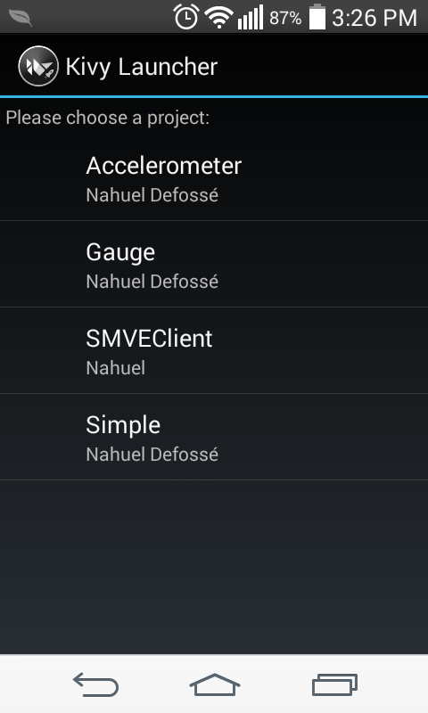

# Características de Kivy

- Framework para escribir aplicaciones multimedia (o al menos con
  capacidades gráficas avanzadas).
- No usa los widgets nativos de la plataforma (agnóstico).
- Solución completa basada en Python/Cython.
- Dibuja sus propios widgets usando aceleración por Hardware (OpenGL).
- Soporte Multi-táctil.
- Licencia MIT

# Sistemas que Soportan Kivy


 * Windows XP, 7, 8
 * Linux
 * OS X
 * **Android 2.3 +**
 * iOS

# Ejemplos de Kivy

  \includegraphics[scale=0.5]{images/how_kivy_is_changing_the_world.png}

  [Museo de Historia Natural de Lille, Francia](https://youtu.be/kXLQ_7GGMnM?t=800),
  [Plane White, exhibición de Arte Interactiva](https://www.youtube.com/watch?v=kXLQ_7GGMnM),
  [Particle Panda, Simulador de Partículas](https://youtu.be/kXLQ_7GGMnM?t=1037),
  [Liatris, Robótica, Deteción de Objetos](https://youtu.be/kXLQ_7GGMnM?t=1508),
  [Monitor de Misubishi LancelotEvo](https://youtu.be/kXLQ_7GGMnM?t=1637)


 <!-- - Kivy utiliza Python como lengaueje de programación, pero permite
   definir la interfase en un lenguaje de específico llamado [`Kv`](https://kivy.org/docs/guide/lang.html). -->

# Ejemplo Mínimo

```python
from kivy.app import App
from kivy.uix.widget import Widget
from kivy.uix.button import Button

class MyWidget(Widget):
  return

class DemoApp(App):
  def build(self):
    return MyWidget()

if __name__ == '__main__':
  DemoApp().run()
```

# Dando estilo

En un archivo con nombre `demo.kv` (por le nombre `DemoApp`):

```YAML
<MyWidget>:
  BoxLayout:
    size: root.size
    Button:
      text: "Hola Mundo"
      on_press: app.decir_hola()

```

Variables utilizables:

  * `app` (`app.root`)
  * `self`  el widget en el que estamos parados
  * `root` la ventana principal

# Otras features

## Garden

## PyJinius

# Kivy Runner

Es una aplicación que permite ejecutar proyectos
kivy en Android sin necesidad de generar el archivo
APK. Simplemente copiando los archivos a la memoria SD o memoria interna.




# Buildozer

* Buildozer es un paquete de Python que permite gestionar la compilación
  de aplicaciones escritas en Kivy.
* En particular nos interesa *Android*

## Creación del archivo de especificaciones

```bash
pip install buildozer
buildozer android init
```

# buildozer.spec

Este archivo define entre otras cosas:

 * Nombre de la aplicación, paquete y version
 * Rutas a los SDK y NDK (si no se definen se   descargar automaticamente)

# APK generado

## adb

Es la herramienta para instalar la aplicación en el telefono cuando no está publicada en el market.


#

## DEMO

# Links sobre Kivy

 * [Kivy - Creating Desktop and Mobile Apps with Python](https://www.youtube.com/watch?v=8zSNzUAfohA)
 * [Kivy with Python tutorial for Mobile Application Development](https://www.youtube.com/watch?v=CYNWK2GpwgA&list=PLQVvvaa0QuDe_l6XiJ40yGTEqIKugAdTy)
 * [Kivy Crash Course](https://www.youtube.com/watch?v=F7UKmK9eQLY&list=PLdNh1e1kmiPP4YApJm8ENK2yMlwF1_edq)
    Muy buen tuorial en videos cortos.

## Gracias!
