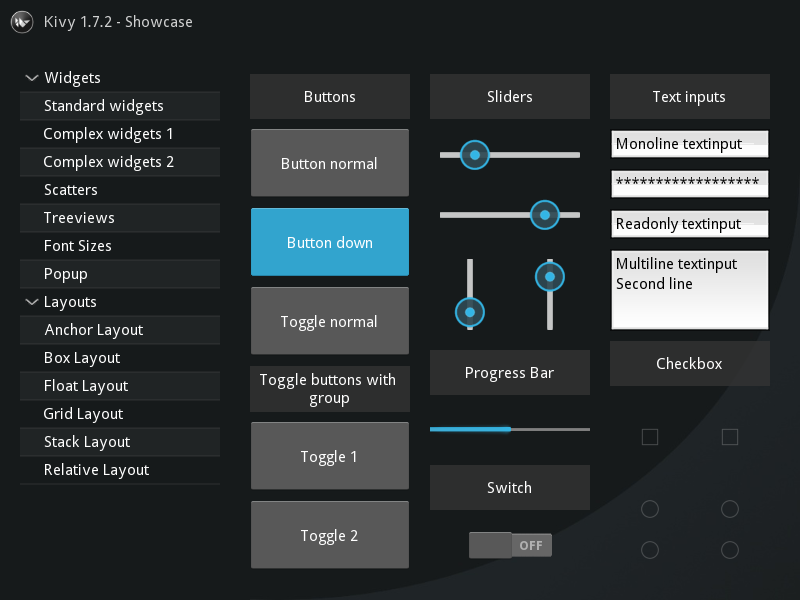
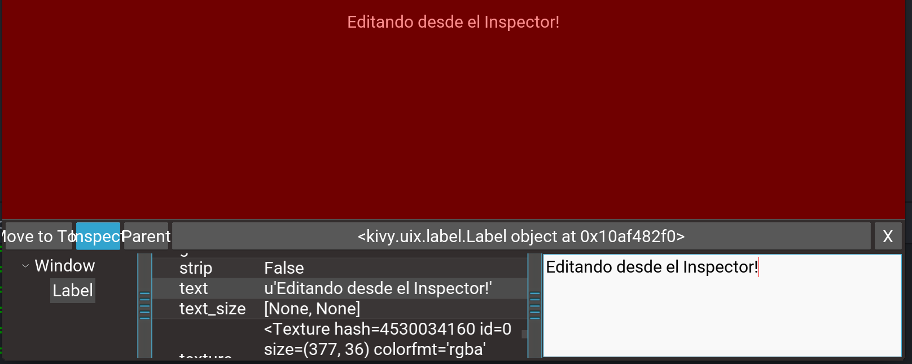
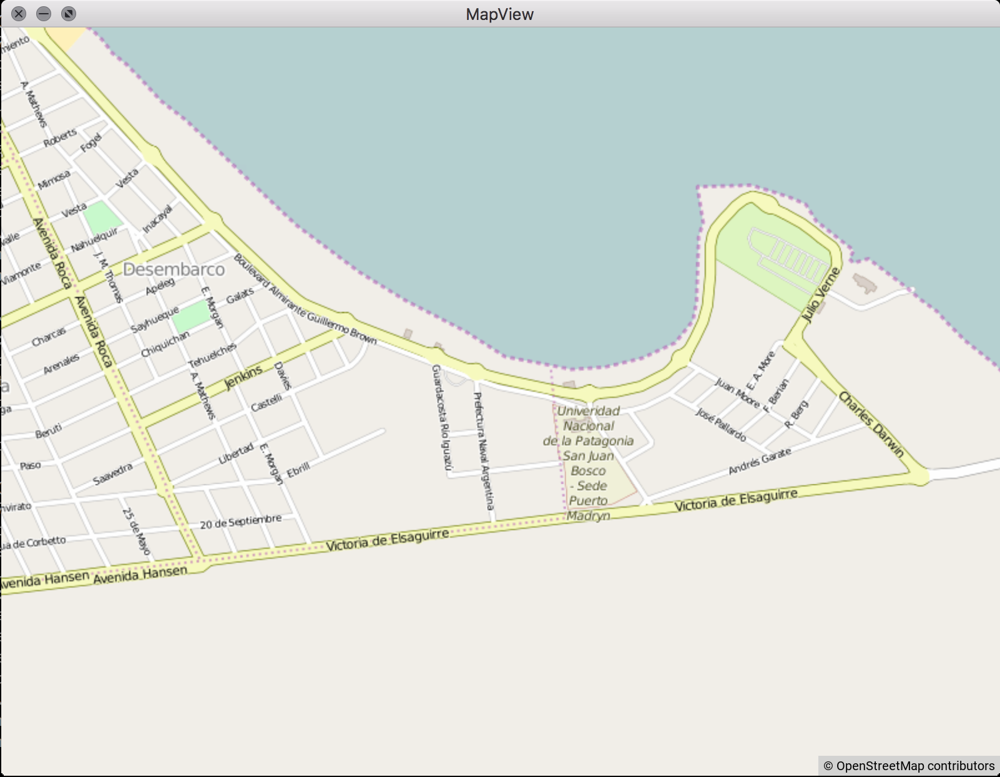

# Características de Kivy

- Framework para escribir aplicaciones multimedia (o al menos con
  capacidades gráficas avanzadas).
- Genera la UI a través de OpenGL (no usa widgets nativos)
- Solución completa basada en Python/Cython.
- Soporte Multi-táctil.
- Soporte en Windows, Linux y Mac, **Android** e iOS.
- Licencia MIT

# Instalación

* Pasos para Windows, Linux y OS X https://kivy.org/docs/installation/installation.html


# Proyectos Hermanos de Kivy

- [Buildozer](https://github.com/kivy/buildozer): empaquetador genérico apara Python (creador de APKs para Android!)
- [Plyer](https://github.com/kivy/plyer): envoltura Pythonica independiente de la plataforma para APIs dependientes de la plataforma.
- [Pyjnius](https://github.com/kivy/pyjnius): Acceso dinámico a Java/Android desde Python.
- [Pyobjus](https://github.com/kivy/pyobjus): acceso dinámico a las APIs
  Objective-C/iOS desde Python.
- [Python for Android](https://github.com/kivy/python-for-android): herramientas para compilar y empaquetar aplicaciones Python para Android.
- [Kivy iOS](https://github.com/kivy/kivy-ios): herramientas para compilar y empaquetar aplicaciones Python para Android.
- [Audiostream](https://github.com/kivy/audiostream): biblioteca para el acceso directo al micrófono y parlante.
- [Kivy Designer](https://github.com/kivy/kivy-designer): Diseñador de interfases para Kivy.
- [KivEnt](https://github.com/kivy/kivent): motor de juegos orientado a entidades.
- [Garden](https://github.com/kivy-garden): widgets y bibliotecas creadas y mantenidas por usuarios.

# Ejemplos de capacidades de Kivy



#


# Ejemplos de la vida real de Kivy

  \includegraphics{images/how_kivy_is_changing_the_world.png}

  *Ejemplos*:
  [Museo de Historia Natural de Lille, Francia](https://youtu.be/kXLQ_7GGMnM?t=800),
  [Plane White, exhibición de Arte Interactiva](https://www.youtube.com/watch?v=kXLQ_7GGMnM),
  [Particle Panda, Simulador de Partículas](https://youtu.be/kXLQ_7GGMnM?t=1037),
  [Liatris, Robótica, Deteción de Objetos](https://youtu.be/kXLQ_7GGMnM?t=1508),
  [Monitor de Misubishi LancelotEvo](https://youtu.be/kXLQ_7GGMnM?t=1637),
  [Teclado TouchContinuum](https://youtu.be/kXLQ_7GGMnM?t=2521)

# Componentes básicos de Kivy

 * App
 * Widget
 * ScreenManager
 * Screen
 * Layouts
 * Button
 * Label
 * TextInput
 * Image
 * Clock
 * SoundLoader
 * Animation

# Ejemplo Mínimo

```python
from kivy.app import App
from kivy.uix.label import Label

class MiApp(App):
    def build(self):
        return Label(text="Hola mundo")

if __name__ == "__main__":
    MiApp().run()
```

## Para correrlo
```bash
python main.py
```

# Depurando una aplicación

Si bien la app no es aún compleja, tenemos un depurador de UIs!
```
python main.py -m inspector
```

Para activar el inspector debemos pulsar `Control` + `e`



# Prueba en Android
Si la aplicación **no** necesita paquetes de terceros, podemos probarla en el  Kivy Laucher de Google Play.


# Prueba en Android (cont.)

Para esto creamos un archivo llamado `android.txt` en la misma carpeta dónde esté main.py, archivos `.kv`, carpeta `data` si la hubiera, etc.

```
proyecto/
  main.py
  estilo.kv
  android.txt
```

Copiamos la carpeta en el telefono a través del administrador de archivos o con el comando `adb` en el directorio kivy.

Ejemplo de `android.txt`
```
title=Demo_1
author=Nahuel
orientation=portrait
```


# Dando estilo

En un archivo con nombre `demo.kv` (por le nombre `DemoApp`):

```YAML
<MyWidget>:
  BoxLayout:
    size: root.size
    Button:
      text: "Hola Mundo"
      on_press: app.decir_hola()

```

Variables utilizables:

  * `app` (`app.root`)
  * `self`  el widget en el que estamos parados
  * `root` la ventana principal


# Utilizando programación reactiva


La programación reactiva trata sobre **reaccionar** a los **cambios**.

\vfill

En kivy podemos generar reacciones a cambios
de  propiedades (de objetos). Por ejmplo, ante el
cambio de un valor de un slider (propiedad `value`)
se actualice un texto de una etiqueta.

\vfill

El lenguaje `kv` permite definir este
 comportamiento de manera muy sencilla.
 La forma de referenciar otros componentes, es utilizar el campo `id`.

# Programación Reactiva

## Ejemplo

```yaml
<MiWidget>:
    BoxLayout:
        orientation: 'vertical'
        size: root.size
        pos: root.pos

        BoxLayout:
            size_hint_y: .2
            Button:
                text: texto.text
                on_press: app.saludar()
        Label:
            text: "%2.3f" % slider.value
            id: texto
        Slider:
            id: slider
```

# Garden

Garden provee widgets mantenidos port terceros.

## Ej. mapview
`mapview` es un widget para mostrar mapas a traves de OpenStreetMaps [`MapView`](https://github.com/kivy-garden/garden.mapview).

## Instalación

```
garden install mapview
```

# Garden (cont.)

## Utilización de mapview

```python
from kivy.garden.mapview import MapView
from kivy.app import App

class MapViewApp(App):
    def build(self):
        mapview = MapView(
          zoom=15,
          lat=-42.7852576,
          lon=-65.0083537)
        return mapview

MapViewApp().run()
```

# Garden (cont.)




# Buildozer

* Buildozer es un paquete de Python que permite gestionar la compilación
  de aplicaciones escritas en Kivy.
* En particular nos interesa *Android*
* Está rota en *OS X* al momento de la charla, para generar apks se puede utilizar una máqiuna virtual.

## Creación del archivo de especificaciones

```bash
pip install buildozer
buildozer android init
```

# buildozer.spec

Este archivo define entre otras cosas:

 * Nombre de la aplicación, paquete y version
 * Rutas a los SDK y NDK (si no se definen se   descargar automaticamente)

# Compilando

## Nota

**buildozer** baja todo, Andoird SDK, Android NDK, ANT, Python-for-Android y lo compila. La primera ejecución puede demorar un buen rato (más de 15 minutos en conexiones de menos de 3Mbits).

## Creación de APK depuración
```
buildozer andoird debug
```

## Creación de APK release
```
buildozer andoird release
```

## Creación de APK y ejecución
```
buildozer andoird debug deploy run
```

# Depuración del APK

## logcat

```
buildozer android logcat
```

Permite ver la salida de depuración de Android. Es importante filtrar lo útil, ya que se ven los mensajes de todas las aplicaciones.

# Usando características propias de Android

## plyer

Envoltura Pythonica. Más fácil de usar. APIs más populares.

## pyjnius

Reflexión, cualquier API, control total sobre Java.

# Demo

Aplicación soundboard, a partir de sonidos de memes de internet.

## Código fuente
https://github.com/D3f0/soundboard

## APK
[https://github.com/D3f0/soundboard/blob/master/bin/Soundboard-0.3.1-debug.apk?raw=true](https://github.com/D3f0/soundboard/blob/master/bin/Soundboard-0.3.1-debug.apk?raw=true)

# Links sobre Kivy

 * [Kivy - Creating Desktop and Mobile Apps with Python](https://www.youtube.com/watch?v=8zSNzUAfohA)
 * [Kivy with Python tutorial for Mobile Application Development](https://www.youtube.com/watch?v=CYNWK2GpwgA&list=PLQVvvaa0QuDe_l6XiJ40yGTEqIKugAdTy)
 * [Kivy Crash Course](https://www.youtube.com/watch?v=F7UKmK9eQLY&list=PLdNh1e1kmiPP4YApJm8ENK2yMlwF1_edq)
    Muy buen tuorial en videos cortos.

# {.frafile}

\vfill

## Gracias!

\vfill

No duden en hacerme consultar a  https://twitter.com/d3f0
